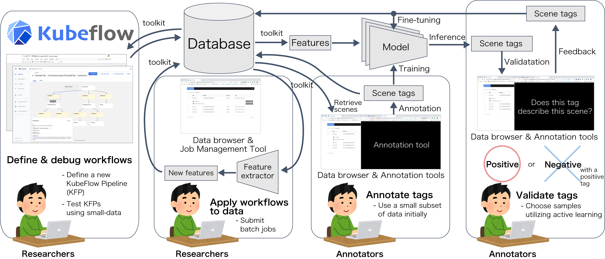

# Dataware-toolsとは？

Dataware-tools はデータの価値を高めるための研究者向けのツール群です。

このプロジェクトでは以下の事を実現することを目標としています:

* 大量かつ多様なデータを簡単に管理する
* ウェブブラウザ上で瞬時にデータの閲覧やアノテーションを行える
* 学習とアノテーションをループされたパイプラインにまとめることで、MLモデルやサービスの開発を加速する

### デモ

Dataware-tools の一部のウェブアプリは[デモページ](https://demo.dataware-tools.com)で試すことができます！\
初めて利用する方はログイン画面からサインアップしてお試しください。

### ワーキンググループ

Dataware-tools は以下のワーキンググループによってメンテナンスされています

| グループ名               | 役割                        |
| ------------------- | ------------------------- |
| wg-deployment       | マニフェストファイルの管理や開発・テスト環境の整備 |
| wg-machine-learning | 機械学習に関連するツールの開発           |
| wg-web-app          | ウェブアプリケーションの開発            |

### コンポーネント

Dataware-toolsを構成するコンポーネントは大きく分けて以下の2種類存在します

* Pythonベースのツールキット ([PyDTK](https://github.com/dataware-tools/pydtk))
* ウェブアプリ

Pythonベースのツールキットはファイルのメタ情報の登録・管理・利用を一元的に行うためのツールです。CLIも備えられているため、研究者は主にこのツールキットを使って機械学習に用いるデータの管理や整形を行うことを想定しています。

ウェブアプリにはデータ閲覧用のアプリやラベル付け用のアプリなどが含まれます。また、研究者に限らず組織外の人でも利用できるよう、ユーザごとの権限管理機能やメタ情報の公開限定機能などが含まれています。\
また、ウェブアプリのバックエンドの実装がPythonベースのツールキットに基づいているため、アプリ上で閲覧したデータをそのままツールキットで利用できる設計になっています。

### リポジトリ構成

GitHub上のdataware-tools組織にあるリポジトリの主な内容は以下の通りです

| リポジトリ名         | 内容物                       |
| -------------- | ------------------------- |
| app-\*         | ウェブアプリのフロントエンド            |
| api-\*         | ウェブアプリで使用するバックエンドAPI      |
| docs           | このドキュメント                  |
| manifests      | デプロイ用のマニフェストファイル          |
| protocols      | バックエンドAPIの仕様書など           |
| pydtk          | Pythonベースのツールキット          |
| test-infra     | 開発・テスト環境のインフラストラクチャ       |
| web-deployment | GitHub Actions を使用したCI/CD |

ウェブアプリは複数のバックエンドAPIに依存しているため、それぞれのアプリはスタンドアローンで使用することはできません。\
アプリのインストール方法や利用手順などについては、「[Dataware-toolsを使ってみる](getting-started/depuroimento.md)」の章を参照してください。
