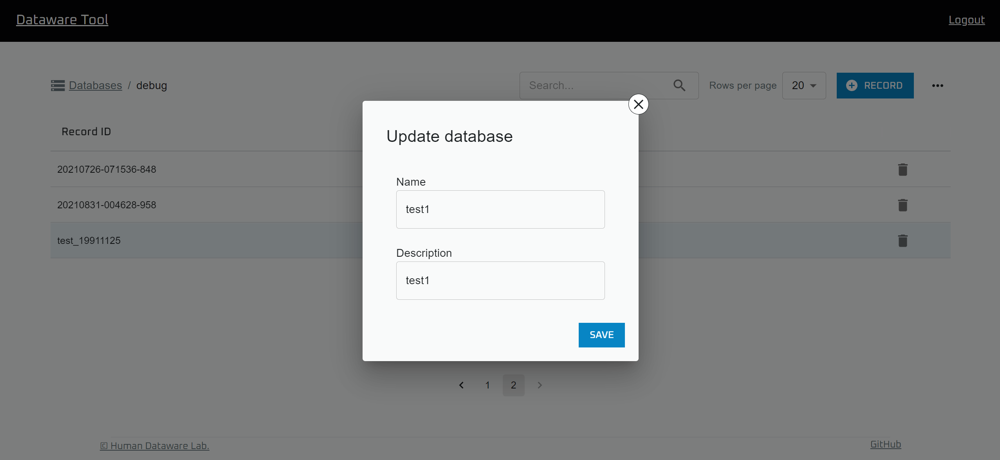

# データベースの管理

## データベースの作成

"Data Browser" を開きます

右上の "+ Database" ボタンをクリックし、

必要な情報を入力した後、 "Save" をクリックすることで新しいデータベースを作成することができます。

"Database ID" は，データベースの識別子となっているため，後から変更できません。

なお、この操作をするためには `Add Database` の権限が必要になります。

## 情報の更新

.png>)

Data Browser で，情報を更新したいデータベースを選択します

.png>)

右上のメニューから，"Update database info" を選択します

必要な情報を書き換えた後，"Save" を押すと情報が更新されます

なお，この操作をするためには `Write Database` の権限が必要です

## 設定の変更

.png>)

Data Browser で，設定を更新したいデータベースを選択します

.png>)

右上のメニューから，"Configure database" を選択します

.png>)

以下で各設定の変更方法を述べていきますが，変更を保存するには "SAVE" をクリックする必要があります

なお，設定の変更に `Write databases` の権限が必要です

### 入力設定の変更

.png>)

"INPUT FIELDS" タブからは，入力設定を編集できます

#### 入力項目の追加

.png>)

”＋”ボタンをクリックすると，入力項目を追加できます

.png>)

以下の項目を入力して "ADD" をクリックすると入力項目が追加されます

* Name: 新しい入力項目の名前です．データベース上ではこの値を項目の名前として扱っています．
* Display name: 新しい入力項目の，DataBrowser上での表示名です．
* Necessity: 新しい入力項目の入力が必須であるかを決める値です．どの値をとるかで，DataBrowserからレコードを追加する時の挙動が変化します．
  * Required: この項目が未入力だとデータベースにレコードを追加できません．
  * Recommended:この項目が未入力だと，未入力のままでいいか確認が出ます．
  * Optional: この項目が未入力でも何も起こりません．

#### 入力項目の削除

.png>)

入力項目右側のごみ箱アイコンをクリックすると入力項目を削除できます

#### 入力項目の編集

.png>)

入力項目左側のアイコンをドラッグすると入力項目の順番を入れ替えることが出来ます

.png>)

入力項目右側のセレクタから，その入力項目の`Necessity` を変更できます

### 表示設定の変更

.png>)

"DISPLAY FIELDS" タブからは，表示設定の変更が出来ます

#### レコード一覧画面に表示される項目の編集

.png>)

"+" をクリックすると項目を追加できます

.png>)

項目名右側にあるごみ箱アイコンをクリックすると，項目を削除できます

.png>)

項目名をクリックすると，その項目を変更できます

.png>)

項目名左側のアイコンをドラッグすると順番を変更できます

#### レコード詳細画面のタイトルに表示される項目の変更

.png>)

"Record title" 下の項目名から変更できます
