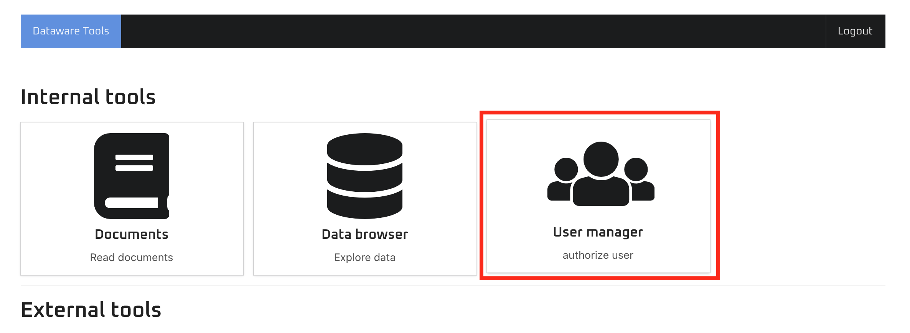
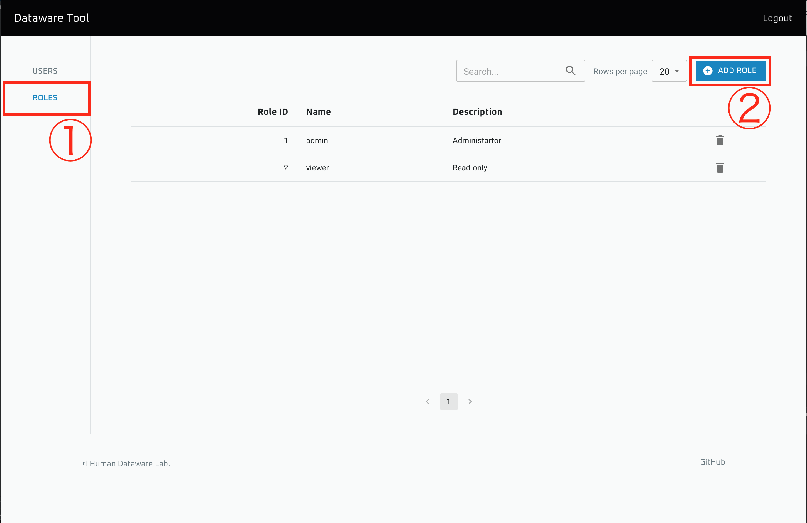
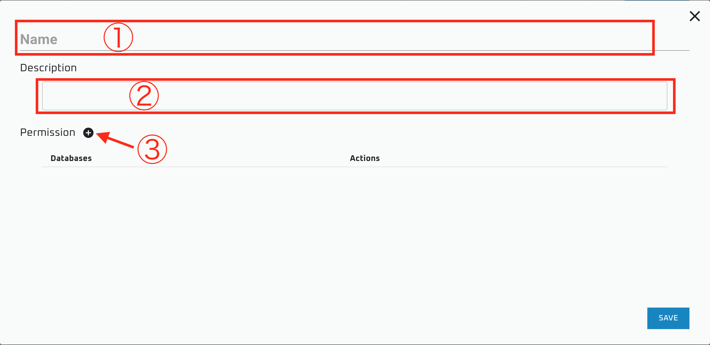
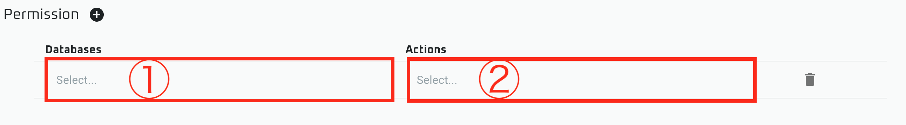
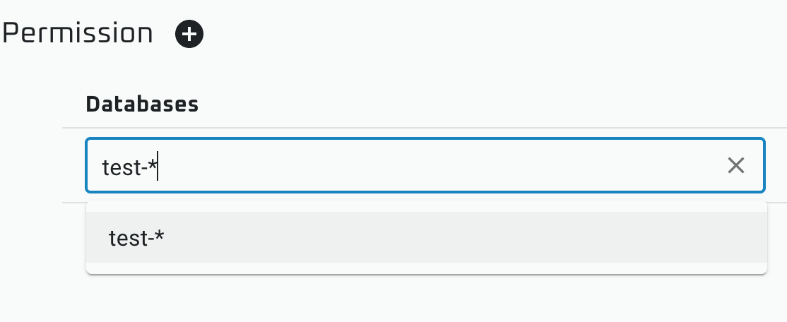
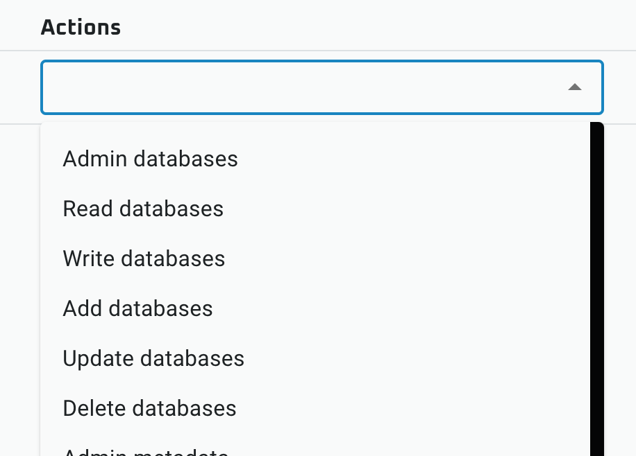

# ユーザの権限管理

Dataware-tools のウェブアプリでは、[Role Based Access Control \(RBAC\)](https://ja.wikipedia.org/wiki/%E3%83%AD%E3%83%BC%E3%83%AB%E3%83%99%E3%83%BC%E3%82%B9%E3%82%A2%E3%82%AF%E3%82%BB%E3%82%B9%E5%88%B6%E5%BE%A1) に基づいてユーザの権限を管理しています。

すなわち、「ファイルのメタ情報を見る」や「新しいファイルを追加する」といった権限は Role に紐付けられ、その Role が割り当てられたユーザがそれらの権限を持つことになります。

以下では、Dataware-tools に含まれる `app-user-manager` を使って Role の定義とユーザへの割当方法について記述します。

## Role の作成

"User manager" を開きます

"Role" パネルに移動し、 "Add Role" をクリックします

①に Role の名前、②に説明文を入力します。  
その後、③のボタンをクリックします。

ここでは、①で権限を適用する対象のデータベース名を、②で権限の内容を指定します。  
なお、この欄は任意の数だけ増やすことができます。

①でデータベース名を指定する際、ワイルドカード \(`*`\) を使用することができます。  
例えば上の画像の例の場合、`test-abc` や `test-1` など `test-` で始まるデータベースが対象になります。

②では該当のデータベースで許可する操作を指定します。  
なお、Actions には以下の内包関係が存在しています。

$$
{\rm admin} \supset {\rm read}, \ \ \ \ \   {\rm admin} \supset {\rm write}
$$

$$
{\rm read} \supset {\rm read\_public}
$$

$$
{\rm write} \supset {\rm add}, \ \ \ {\rm write} \supset {\rm update}, \ \ \ {\rm write} \supset {\rm delete}
$$

