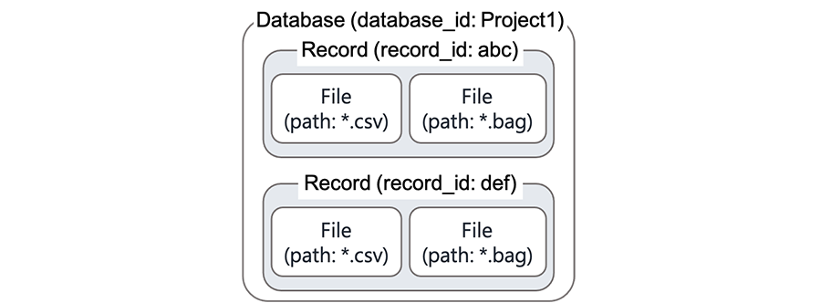

# Dataware-toolsでの概念

Dataware-tools ではデータを扱う上で以下の4つの単位を定義している。

| 単位 | 内容 |
| :--- | :--- |
| Database | 収録データの集まり（データ収集の1つのプロジェクト等） |
| Record | 1つの収録（運転データの場合、1つの運行に相当） |
| File | 1つのファイル（運転データの場合、Rosbagファイルに相当） |
| Content | ファイルの内容物（運転データの場合、Rosbagトピックに相当） |

これら4つの概念の間には

$$
{\rm Database} \ni {\rm Record} \ni {\rm File} \ni {\rm Content}
$$

という内包関係が成り立つものとする

Dataware-tools では、これらのメタ情報をNoSQLデータベースに格納しているが、NoSQLデータベース上でのデータの単位と上記の単位は以下のような関係になっている。

| NoSQLデータベース上での単位 | Dataware-tools上での単位 |
| :--- | :--- |
| Collection | Database |
| Document | File |

つまり Dataware-tools では、ファイル単位のメタ情報を辞書型のオブジェクトとしてNoSQLデータベースに格し使用している。

