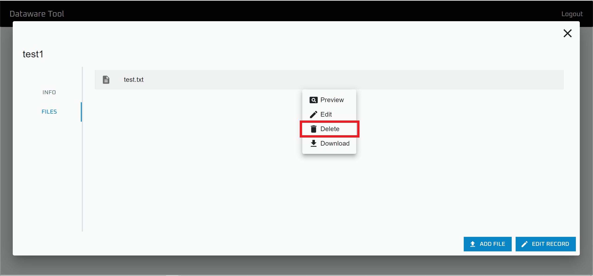

# ファイルの追加と編集

## ファイルの追加

"Data Browser" を開きます

ファイルを追加したいレコードがあるデータベースを開きます

.png>)

ファイルを追加したいレコードを選択します

"ADD FILE" をクリックします\
確認画面で同意するとファイルを追加することが出来ます

なお，この操作を行うには`Add file` の権限が必要です

## ファイルの削除

"Data Browser" を開きます

ファイルを削除したいレコードがあるデータベースを開きます

.png>)

ファイルを削除したいレコードを選択します

削除したいファイルを選択して，"Delete" をクリックします\
確認画面で同意するとファイルを削除することが出来ます

なお，この操作を行うには `Delete file` の権限が必要です
