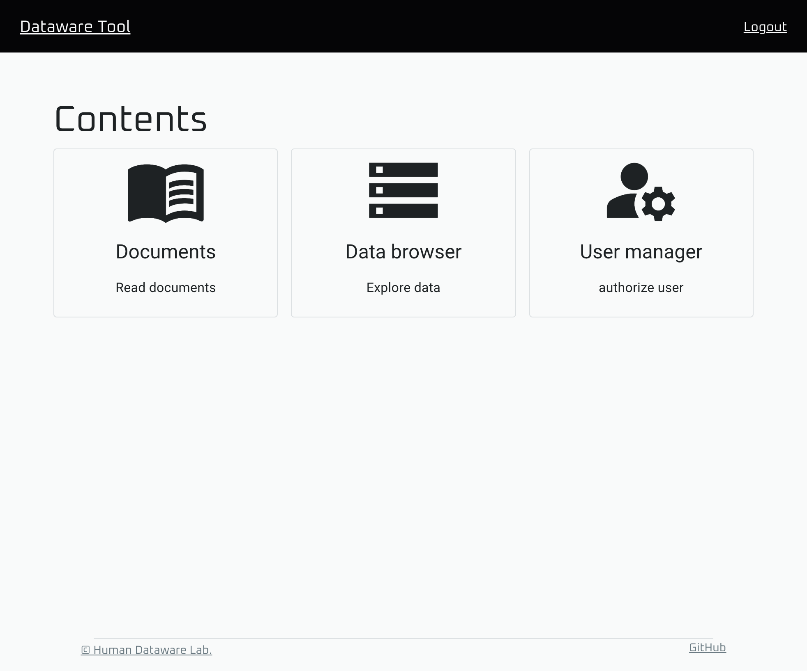

# 4. Dataware-tools のデプロイ

### 1. Kubernetesマニフェストファイルの用意

#### 1.1 マニフェストファイルの入手

GitHub の dataware-tools/manifests リポジトリを clone します。

```bash
git clone https://github.com/dataware-tools/manifests.git
```

`main` ブランチは安定していない可能性があるため、任意のタグ (例: v0.2.5) に checkout します。

```bash
cd manifests
git checkout v0.2.5
```

#### 1.2 環境設定の編集

`distributions/demo` フォルダをコピーし、`env` フォルダ内の `*.env` ファイルをデプロイ先の環境に合わせて修正します。

```bash
cd distributions
cp -r demo my_deploy
cd my_deploy
vim env/...  (*.env ファイルを編集)
```

なお、`*.env` ファイルに記述する内容は以下の通りです。

* `apps_configs.env`:
  * `AUTH0_DOMAIN`: [先に作成したAuth0のアプリケーション](1-auth0-notenantoworu.md#2-apurikshonno)のDomain
  * `AUTH0_APP_CLIENT_ID`: [先に作成したAuth0のアプリケーション](1-auth0-notenantoworu.md#2-apurikshonno)のClient ID
  * `AUTH0_API_URL`: `https://<dataware-toolsのデプロイ先のドメイン名>/`
  * `AUTH0_MANAGE_PAGE`: Auth0のダッシュボード画面のURL
  * `PYDTK_META_DB_ENGINE`: `mongodb` (変更する必要はありません)
  * `PYDTK_META_DB_HOST`: `mongodb:27017` (変更する必要はありません)
  * `PYDTK_META_DB_USERNAME`: `datawaretools` (変更する必要はありません)
  * `PYDTK_META_DB_DATABASE`: `datawaretools` (変更する必要はありません)
  * `WEBVIZ_APP_URL`: `https://<dataware-tools>のデプロイ先のドメイン名>/webviz/app/` もしくは `https://webviz.io/app/`
  * `WEBVIZ_WEBSOCKET_HOST`: `<dataware-toolsのデプロイ先のドメイン名>`
* `apps_secrets.env`:
  * `AUTH0_API_CLIENT_ID` : [先に作成したauth0-authz](1-auth0-notenantoworu.md#5-app-user-managernosettoappu)のClient ID
  * `AUTH0_API_CLIENT_SECRET`: [先に作成したauth0-authz](1-auth0-notenantoworu.md#5-app-user-managernosettoappu)のClient Secret
  * `PYDTK_META_DB_PASSWORD`: [mongodbのアカウント作成時](3-depuroino.md#mongodb-sbahenoyza)の設定に合わせてください
* `networking.env`:
  * `DATAWARE_TOOLS_GATEWAY_HOST`: `<dataware-toolsのデプロイ先のドメイン名>`
* `security.env`:
  * `ISSUER`: `https://<Auth0のテナント名>/`
  * `JWKS_URI`: `https://<Auth0のテナント名>/.well-known/jwks.json`
  * `AUDIENCE`: `https://<dataware-toolsのデプロイ先のドメイン名>`
* `webviz.env`:
  * `WEBVIZ_GATEWAY_HOST`: `<dataware-tools>のデプロイ先のドメイン名>`

### 2. デプロイ

デプロイには以下のツールを使用します。

* [kubectl](https://github.com/kubernetes/kubectl) >= v1.20.0
* [kustomize](https://github.com/kubernetes-sigs/kustomize) >= v4.0.0

#### 2.1 権限のチェック

デプロイの前に `kubectl` コマンドでデプロイ先の Kubernetes クラスタにアクセスできることを確認してください。  
また、以下のコマンドによりクラスタに任意のリソースを作成/削除できることを確認してください:

```bash
# デプロイ先の名前空間を作成する権限をチェック (yes と表示されれば OK)
kubectl auth can-i create namespaces --all-namespaces

# デプロイ先の名前空間に対するリソースの作成権限をチェック (yes と表示されれば OK)
kubectl auth can-i create '*' --namespace <デプロイ先の名前空間>

# デプロイ先の名前空間に対するリソースの削除権限をチェック (yes と表示されれば OK)
kubectl auth can-i delete '*' --namespace <デプロイ先の名前空間>
```

#### 2.2 名前空間の作成

以下のコマンドによりデプロイ先の名前空間を作成します:

```bash
kubectl create namespace <デプロイ先の名前空間>
```

次に、この名前空間に対する Istio の sidecar の injection を有効化します。

```bash
kubectl label namespace <デプロイ先の名前空間> istio-injection=enabled --overwrite
```

#### 2.3 マニフェストの適用

`kustomize` コマンドを使用してマニフェストが生成できることを確認します:

```bash
cd manifests/distributions/my_deploy
kustomize build . > /dev/null
```

エラーが表示された場合は設定に不備がある可能性があります。

次に、生成されたマニフェストを `kubectl` コマンドを使用して適用します:

```bash
kustomize build . | kubectl -n <デプロイ先の名前空間> apply -f-
```

以上でデプロイが完了します。

#### 2.4 (必要に応じて) Ingress の作成

オンプレミス環境など、istio の ingressgateway が LoadBalancer に接続されない環境にある場合は、以下のコマンドにより Ingress リソースを追加する必要があります:

```
kubectl -n istio-system apply -f-<<EOF
apiVersion: networking.k8s.io/v1
kind: Ingress
metadata:
  name: istio-ingressgateway
  namespace: istio-system
spec:
  rules:
  - host: <dataware-toolsのデプロイ先のドメイン名>
    http:
      paths:
      - path: /
        pathType: Prefix
        backend:
          service:
            name: istio-ingressgateway
            port:
              number: 8080
EOF
```

これにより、クラスタ外部から `http://<dataware-toolsのデプロイ先のドメイン名>` もしくは `https://<dataware-toolsのデプロイ先のドメイン名>` に来たHTTPリクエストが Istio の ingressgateway を経由して dataware-tools のサービスへと送られます。

### 3. 動作確認

#### 3.1 Pod の状態確認

以下のコマンドによりデプロイ先の名前空間内のPodの状態の一覧を取得できます:

```bash
kubectl -n <デプロイ先の名前空間> get pods
```

表示されたすべてのPodの状態が `Running` になっていることを確認します。

また、`READY` 列に表示されるコンテナの数が2以上になっていることを確認して下さい。  
コンテナが1つしか存在していない場合は Istio の sidecar が inject されていない可能性があります。

何か問題がある場合は、以下のコマンドにより詳しい状態を確認することができます:

```bash
kubectl -n <デプロイ先の名前空間> describe pod <対象のPodの名前>
```

#### 3.2 サービス, Ingress の状態確認

以下のコマンドを実行し、Istio の ingressgateway の外部IPアドレスを取得します:

```
kubectl -n istio-system get service istio-ingressgateway
```

`EXTERNAL IP` の部分が該当のIPアドレスです。

IPアドレスが存在しない場合は[2.4](depuroimento.md#24-nijite-ingress-no)を参考に Ingress を作成して下さい。  
その後、以下のコマンドにより Ingress の外部IPアドレスを取得します:

```
kubectl -n istio-system get ingress istio-ingressgateway
```

取得した外部IPアドレスを参考に、DNS のレコードを設定してください。

以下の行を一時的に `/etc/hosts` に登録し、DNS の設定なしで確認することもできます:

```
<外部IPアドレス> <dataware-toolsのデプロイ先のドメイン名>
```

確認が終わったら `/etc/hosts` から上記の行を削除することを忘れないでください。

#### 3.3 Webブラウザからの確認

Webブラウザ上で `https://<dataware-toolsのデプロイ先のドメイン名>/` にアクセスし、以下のような画面が表示されることを確認します。


