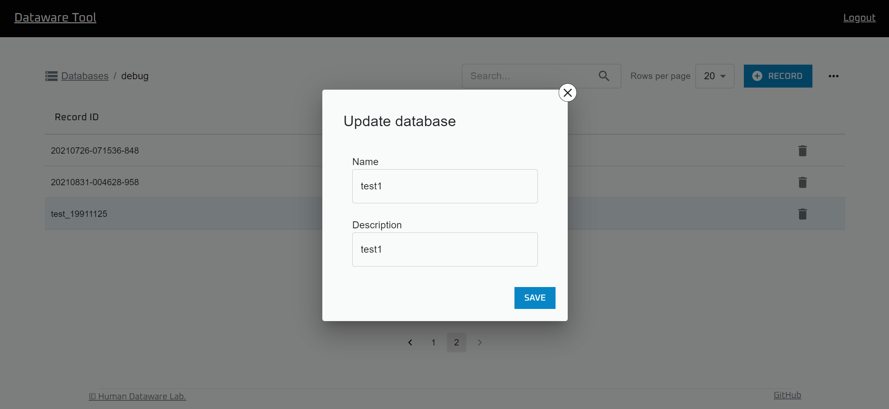
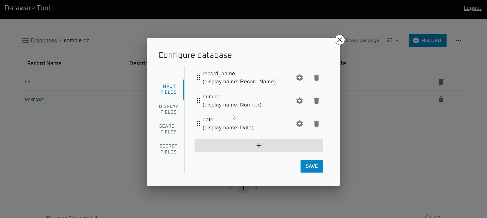

# データベースの管理

&#x20;Dataware-tools では、Database に Record を追加することでデータを蓄積していきます。

したがって、Dataware-tools を用いてのデータ管理は、Database の作成から始まるのが基本的な流れです。

以下では、`Data browser` を用いて Database を作成・管理する方法を述べていきます

## データベースの作成

※ この操作をするためには `Add Database` と `Update Database`の二つの権限が必要です。

.png>)

トップページから `Data browser` を開きます。

右上の `+ DATABASE` ボタンをクリックすると、Database の情報を入力するためのダイアログが表示されます。

.png>)

必要な情報を入力した後、 SAVE をクリックすることで新しいDatabaseを作成することができます。

尚、`Database ID` は識別子となっているため、後から変更できません。また、他の Database と重複させられないことに注意してください。

## 情報の更新

※ この操作をするためには `Read Database` と `Update Database` の二つの権限が必要です。

.png>)

`Data browser` で更新したい Database を選択します。

.png>)

右上のメニューから `Update database info` を選択します。

必要な情報を書き換えた後、`SAVE` を押すと情報が更新されます。

## 設定の変更

※ この操作をするためには `Read Database` と `Update Database` の二つの権限が必要です。

.png>)

`Data browser` で、設定を更新したい Database を選択します。

.png>)

右上のメニューから、`Configure database` を選択します。

.png>)

### 入力設定の変更

.png>)

`INPUT FIELDS` タブからは、ユーザーがレコードを追加する時に入力できる項目を編集できます。

#### 入力項目の追加

.png>)

`＋`をクリックすると、入力項目を追加できます。

.png>)

以下の項目を入力して `ADD` をクリックすると入力項目が追加されます。

* Name: 新しい入力項目の名前です。この値は入力項目の識別子として扱われます。
* Display name: `Data browser`で上での表示名です。
* Data type: 新しい入力項目の型です。どの値をとるかで、Record を追加する時の挙動が以下のように変化します。
  * String: プレーンな入力欄に、任意の文字列が入力できるようになります。
  * Number: プレーンな入力欄に、数値のみを入力できるようになります。
  * Date: デートピッカーのついた入力欄に、日時のみを入力できるようになります。
* Necessity: 入力が必須であるかを決める値です。どの値をとるかで、Record を追加する時の挙動が以下のように変化します。
  * Required: 未入力だと Databae に Record を追加できません。
  * Recommended:未入力だと、未入力のままで良いか確認が出ます。
  * Optional: 未入力でも何も起こりません。
* Visibility:公開するかどうかを決める値です。チェックを入れると、 `Read public` の権限のみを持つユーザーには、この項目は表示されなくなります。

#### 入力項目の削除

.png>)

入力項目右側のごみ箱アイコンをクリックすると入力項目を削除できます。

#### 入力項目の編集

入力項目をドラッグすると入力項目の順番を入れ替えることが出来ます。

.png>)

入力項目右側の歯車アイコンをクリックすると、入力項目の設定を変更できます。

### 表示設定の変更

.png>)

`DISPLAY FIELDS` タブからは、`Data browser` 上で表示される項目を変更出来ます。

#### レコード一覧画面に表示される項目の追加

.png>)

`+` をクリックすると項目を追加できます。

#### レコード一覧画面に表示される項目の削除

.png>)

項目名右側にあるごみ箱アイコンをクリックすると、項目を削除できます。

#### レコード一覧画面に表示される項目の変更

.png>)

項目名をクリックすると、その項目を変更できます。

.png>)

項目名左側のアイコンをドラッグすると順番を変更できます。

#### レコード詳細画面のタイトルに表示される項目の変更

.png>)

`Record title` 下の項目名をクリックすると、レコード詳細画面のタイトルに表示される項目を変更できます。

### 検索設定の変更

.png>)

`SEARCH FIELDS` タブからは、`Data browser` 上で検索時に、検索対象となる項目を変更出来ます。

#### 検索対象項目の追加

.png>)

`+` をクリックすると項目を追加できます。

#### 検索対象項目の削除

.png>)

項目名右側にあるごみ箱アイコンをクリックすると、項目を削除できます。

#### 検索対象項目の変更

.png>)

項目名をクリックすると、その項目を変更できます。

### 公開設定の変更

.png>)

`SECRET FIELDS` タブからは、`Data browser` 上で公開するデータを選択できます。

#### 公開項目の追加

.png>)

`+` をクリックすると項目を追加できます。

#### 公開項目の削除

.png>)

項目名右側にあるごみ箱アイコンをクリックすると、項目を削除できます。

#### 公開項目の変更

.png>)

項目名をクリックすると、その項目を変更できます。

