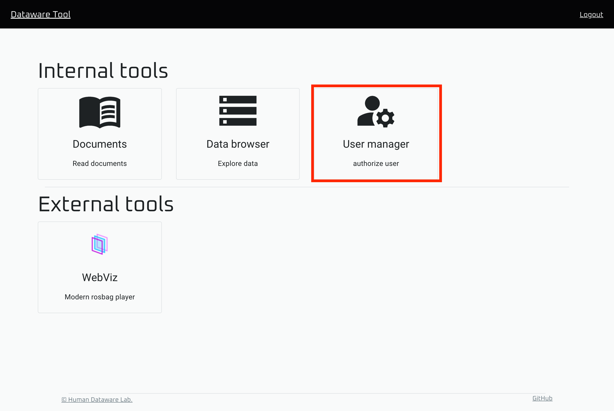
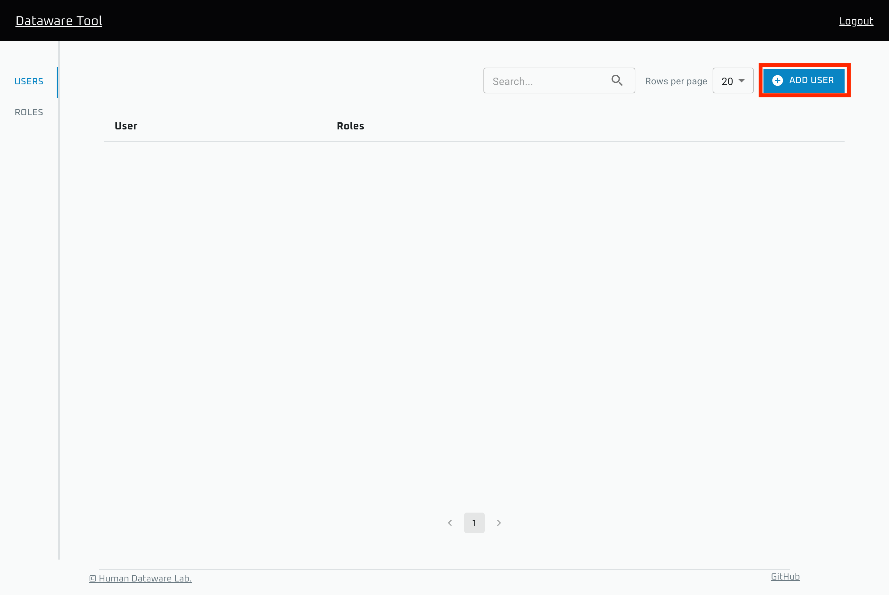
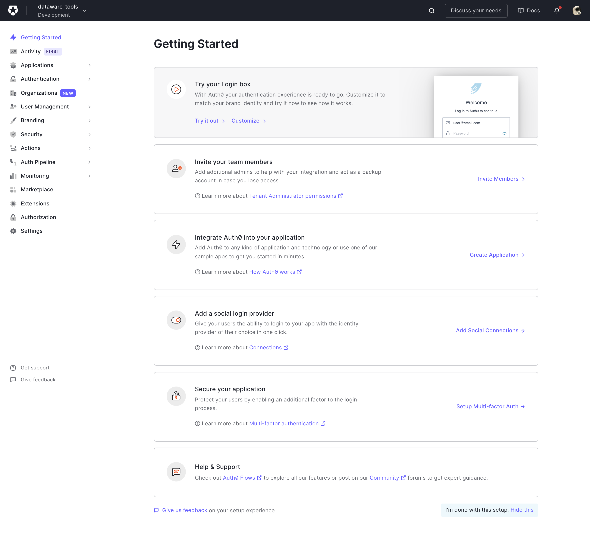
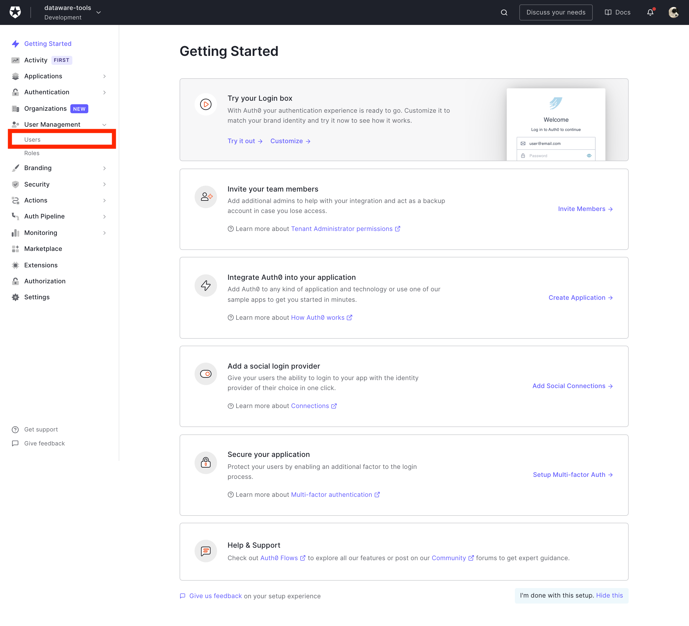

# ユーザアカウントの追加

Dataware-tools のウェブアプリケーションで使用するユーザアカウントを新たに追加するには以下の操作を行います。

### Auth0のユーザ管理ページを開く

トップページから `User manager` を開きます。

画面右上の `ADD USER` をクリックします。
これにより、Auth0 の管理ページに遷移します。

### Auth0 で新規ユーザアカウントを追加する

メニューから `User Management` -> `Users` を選択します。

.png>)

`Create User` をクリックし、新しいユーザが使用するメールアドレスとパスワードを入力してください。

以上の操作で新規ユーザアカウントが登録できました。

### 新規ユーザアカウントのアクティベーション

登録された新規ユーザアカウントを有効化するために、Auth0から新規ユーザのメールアドレス宛に送信されたメールを開き、そこに記載されているURLを開いて下さい。

この操作により新規ユーザアカウントが有効化され、ログインできる状態になります。

### (必要に応じて) 特権ユーザ化

新規作成したユーザアカウントが他のユーザのデータへのアクセス権を制御できるようにするには、以下の部分の指示に従ってアカウントを特権化する必要があります。

[インストールガイド 
-> 2.Auth0のテナントを作る 
-> 4.ユーザの作成](../insutrugaido/1-auth0-notenantoworu.md#41-auth0niyzawosuru) 
-> ※以下は特権ユーザに対してのみ実施する作業です
