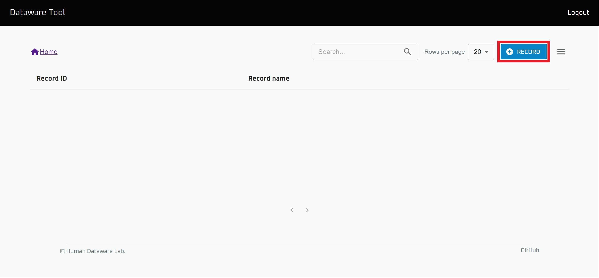
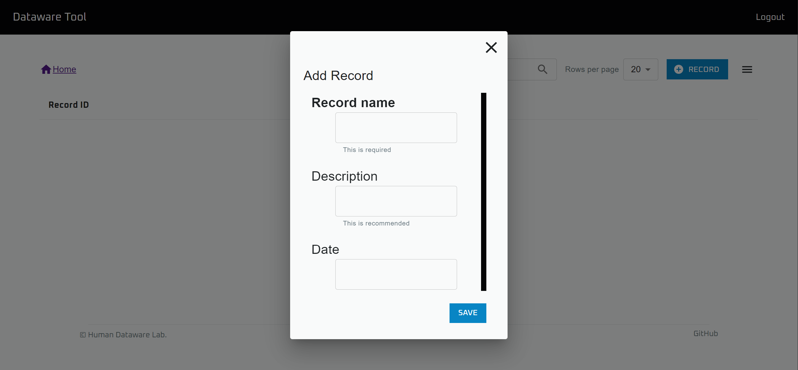
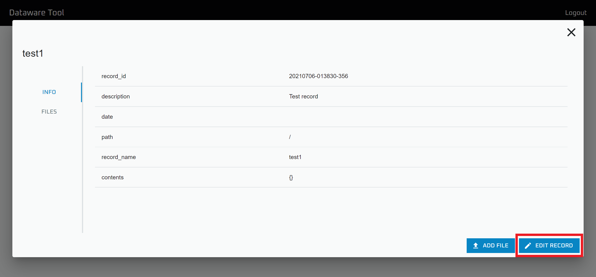
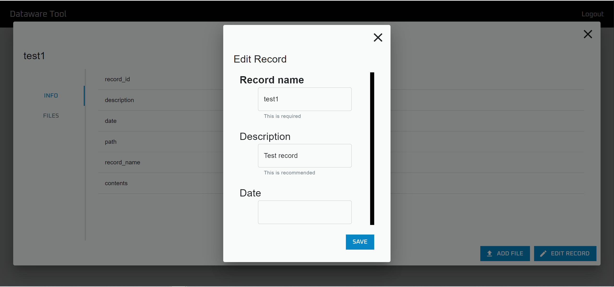
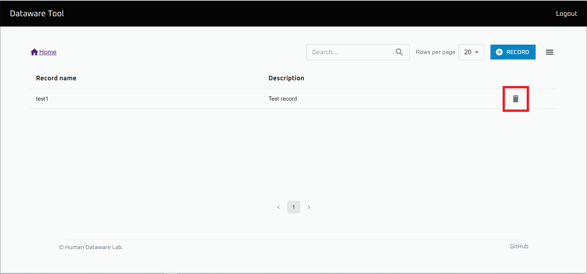

# レコードの追加と編集

`Data browser` を用いることで、GUI から Database にデータを追加することが出来ます。

以下では、`Data browser` 上で基礎的なデータ単位となっている Record を追加、編集する手順を記します。

## レコードの追加

※ この操作を行うには `Add metadata` の権限が必要です。

.png>)

`Data browser` を開きます。

Record を追加したい Database を開きます。

`+ RECORD` ボタンを押します。

必要な情報を入力した後、 `SAVE` をクリックすることで新しい Record を追加することができます。

## レコードの更新

※ この操作を行うには `Update metadata` の権限が必要です。

.png>)

`Data browser` を開きます。

更新したい Record がある Database を開きます。

.png>)

更新したい Record を選択します。

`EDIT RECORD` をクリックします。

必要な情報を入力した後、 `SAVE` をクリックすることで変更を保存することができます。

## レコードの削除

※ この操作を行うには `Delete metadata` の権限が必要です

.png>)

`Data browser` を開きます。

削除したい Record がある Database を開きます。

右側にあるゴミ箱ボタンをクリックすることで、Record を削除できます。
