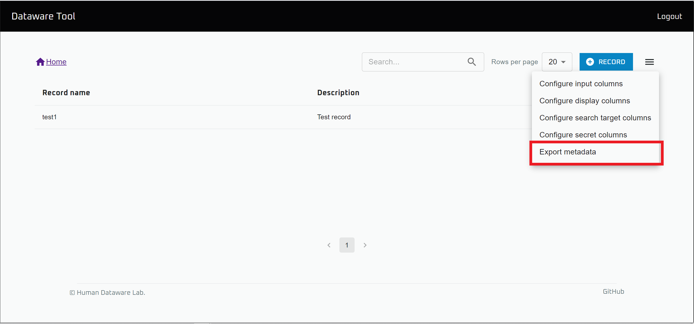
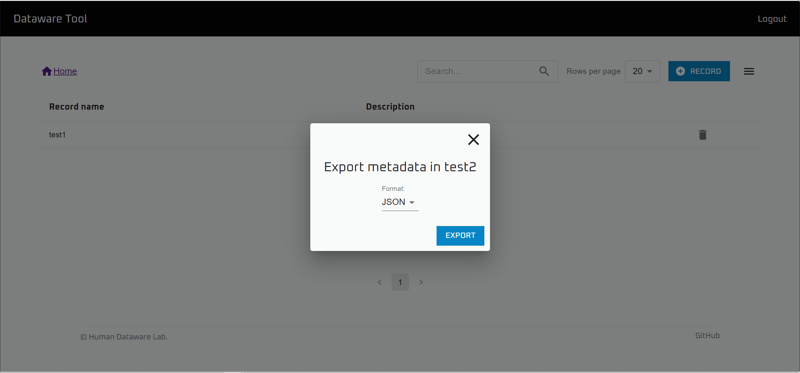

# メタデータの出力

`Data browser` は、データを保存するだけでなく、出力する機能も備えています。

以下では、その方法について記します。

## メタデータの一括出力

※この操作を行うには `Read metadata` の権限が必要です。

.png>)

`Data browser` を開きます。

出力したいメタデータの存在する Database を開きます。

右上のメニューを開き、 `Export metadata` を選択します。

ファイルフォーマットを選択して `EXPORT` を選択すると、メタデータがファイルに一括出力されます。
