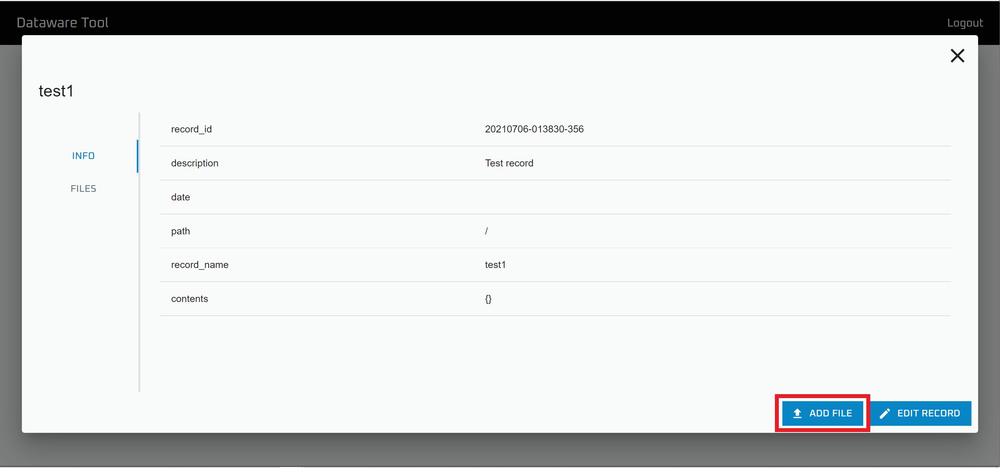
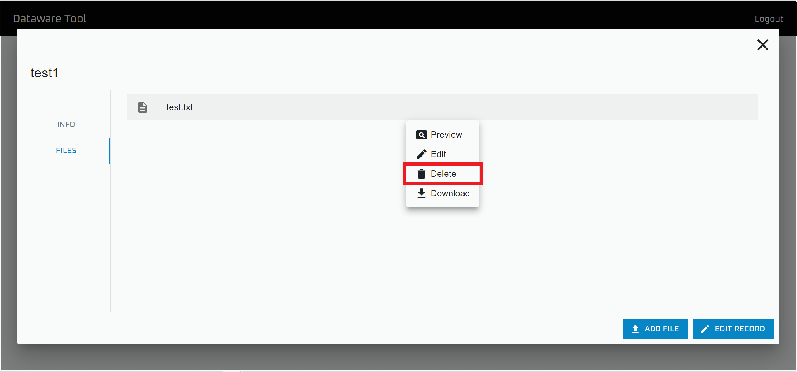

# ファイルの追加と編集

`Data browser` を用いることで、GUIから Record にファイルを紐づけることが出来ます。

以下では、その方法について記述します。

## ファイルの追加

※この操作を行うには`Add file` の権限が必要です。

.png>)

`Data browser` を開きます。

ファイルを追加したい Database を開きます。

.png>)

ファイルを追加したいを Record を選択します。

`ADD FILE` をクリックすることで、ファイルを追加できます。

## ファイルの削除

※この操作を行うには `Delete file` の権限が必要です。

.png>)

`Data browser` を開きます。

ファイルを削除したい Database を開きます。

.png>)

ファイルを削除したい Record を選択します。

削除したいファイルを選択して，`Delete` をクリックすることで、ファイルを削除できます。
