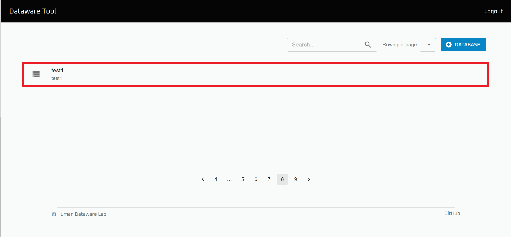
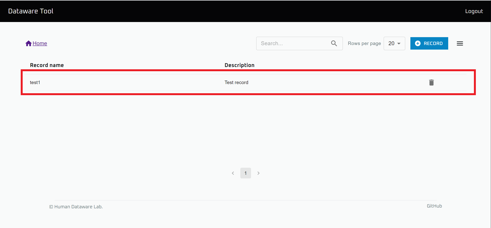
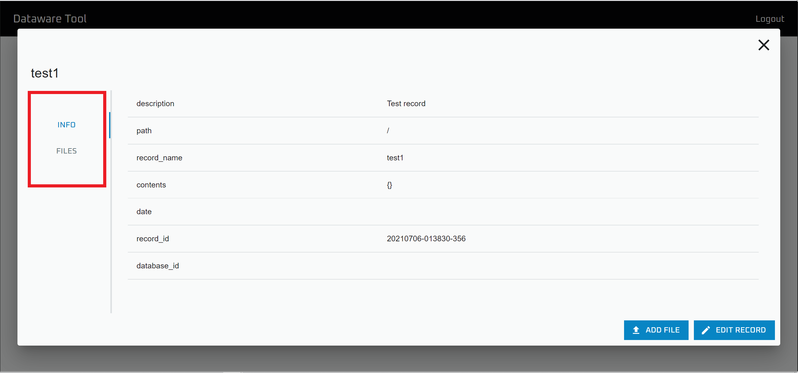
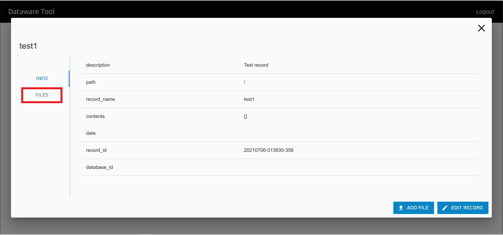
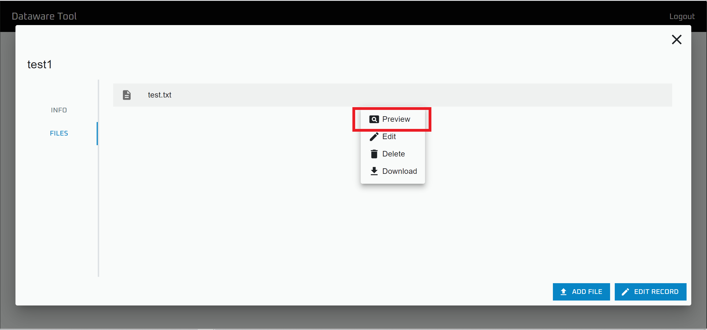
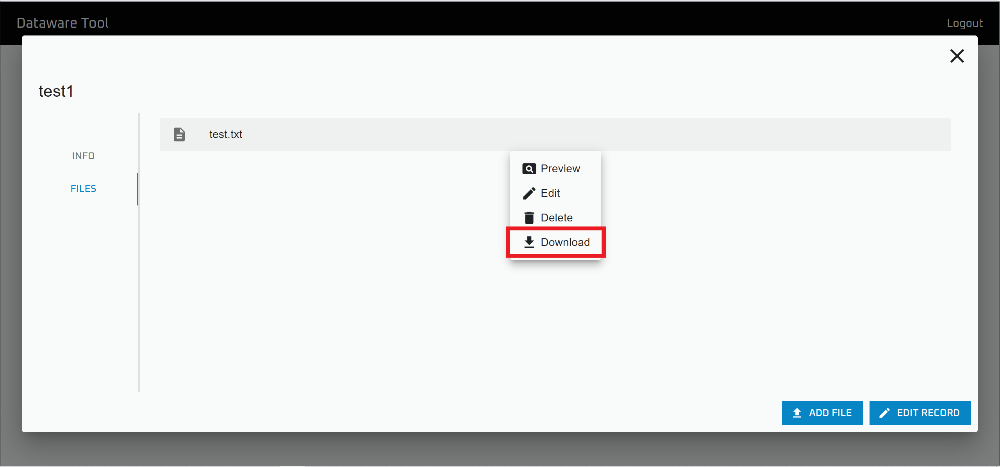

# データの閲覧

`Data browser` を用いることで、dataware-tools 上で管理されているデータを GUI から閲覧できます。

以下では、その方法について記します。

## レコードの詳細情報の閲覧

※ この操作を行うには `Read databases` と `Read metadata` の権限が必要です。

.png>)

`Data browser` を開きます。

情報を閲覧したい Database を開きます。

情報を閲覧したい Record を選択します。

`INFO` タブから詳細情報が，`FILES` タブからはファイル一覧が閲覧できます。

## ファイルのプレビュー

※この操作を行うには `Read databases` と `Read metadata` の権限が必要です。

.png>)

`Data browser` を開きます。

プレビューしたいファイルの存在するDatabase を開きます。

.png>)

プレビューしたいファイルの存在する Record を選択します。

`FILES` タブを選択します。

ファイルを選択して`Preview` をクリックすると、ファイルをプレビューできます。

### プレビューできる拡張子一覧

以下の拡張子のプレビューがサポートされています。

* `.txt`
* `.md`
* `.csv`
* `.wav`
* `.mp3`
* `.mp4`
* `.js`, `.jsx`, `.ts`, `.tsx`
* `.py`
* `.sh`
* `.json`
* `.yml`, `.yaml`
* `.jpg` ,`.jpeg`
* `.png`
* `.gif`
* `.bag`

## ファイルのダウンロード

※ この操作を行うには `Read databases` と `Read metadata` と`Read file` の権限が必要です。

.png>)

`Data browser` を開きます。

ダウンロードしたいファイルの存在する Database を開きます。

.png>)

ダウンロードしたいファイルの存在する Record を選択します。

.png>)

`FILES` タブを選択します。

ファイルを選択して`Download` をクリックすると、ファイルをダウンロードできます。
