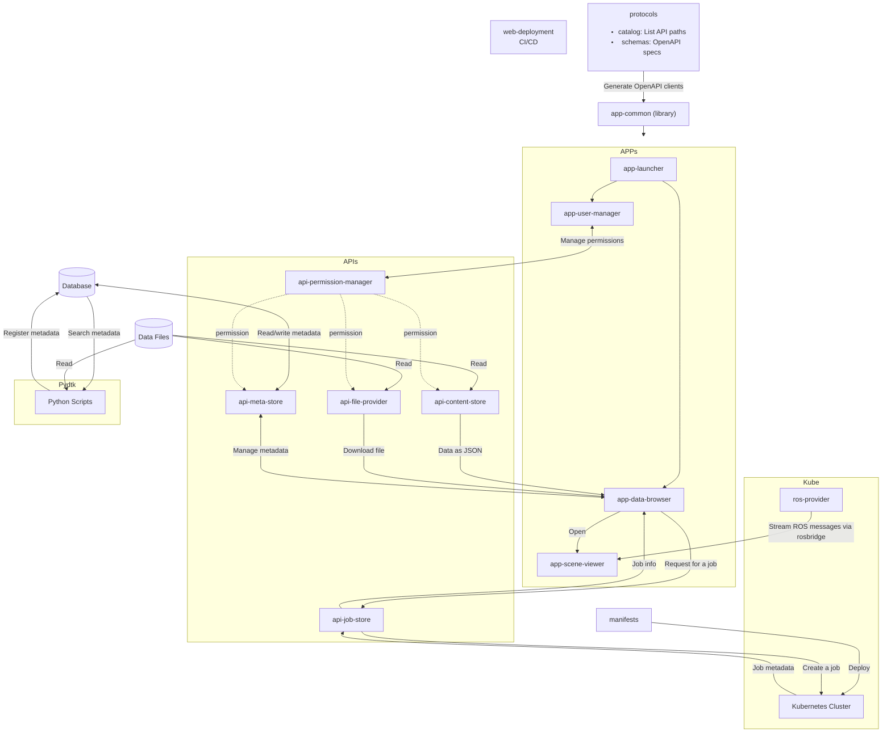

# Relationship of Repositories

```mermaid
flowchart TB

database[(Database)]
data-files[(Data Files)]

%% Deployment
web-deployment[web-deployment<p>CI/CD</p>]
manifests
subgraph Kube
	kube-cluster[Kubernetes Cluster]
	ros-provider[ros-provider]
end

subgraph APIs
	api-permission-manager
	api-job-store
	api-file-provider
	api-content-store
	api-meta-store
end

subgraph APPs
	app-launcher
	app-user-manager
	app-data-browser
	app-scene-viewer
end

subgraph Pydtk
	python-scripts[Python Scripts]
end

%% Between apps
app-launcher --> app-user-manager
app-launcher -------> app-data-browser

%% Between apps and APIs
app-user-manager <--> |Manage permissions|api-permission-manager
api-content-store ---> |Data as JSON|app-data-browser
api-file-provider ---> |Download file|app-data-browser
api-meta-store <---> |Manage metadata|app-data-browser

%% User operations
database <---> |Read/write metadata|api-meta-store
data-files --> |Read|api-file-provider & api-content-store
python-scripts --> |Register metadata|database
database --> |Search metadata|python-scripts
data-files --> |Read|python-scripts

%% Permission
api-permission-manager -..-> |permission| api-file-provider & api-meta-store & api-content-store

%% app-common
protocols[protocols<ul><li>catalog: List API paths</li><li>schemas: OpenAPI specs</li></ul>]
protocols --> |Generate OpenAPI clients|app-common
app-common["app-common (library)"] --> APPs

%% Kube
manifests ---> |Deploy|kube-cluster

%% Job
api-job-store ---> |Create a job|kube-cluster
kube-cluster ---> |Job metadata|api-job-store
app-data-browser ---> |Request for a job|api-job-store
api-job-store ---> |Job info|app-data-browser

%% app-scene-viewer
ros-provider --> |Stream ROS messages via rosbridge|app-scene-viewer
app-data-browser --> |Open|app-scene-viewer
```
