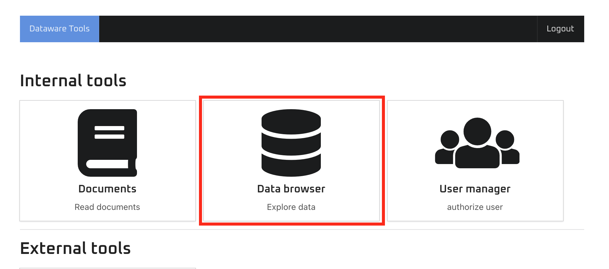
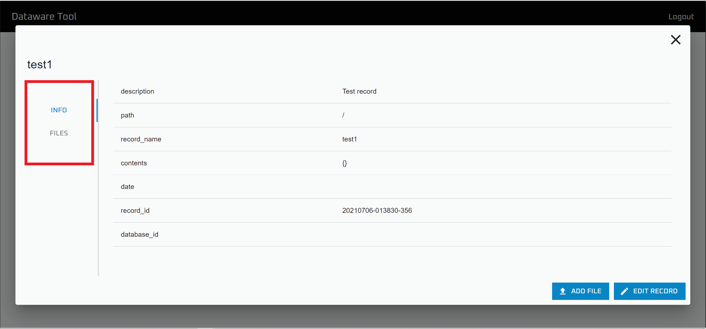
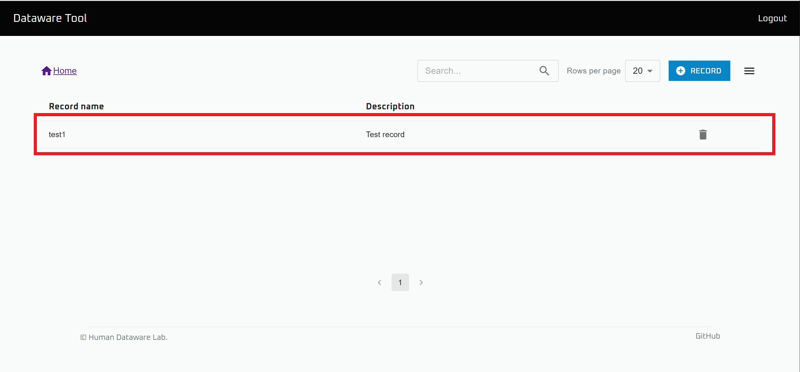

# データの閲覧

## レコードの詳細情報の閲覧

"Data Browser" を開きます

情報を閲覧したいレコードの存在するデータベースを開きます

情報を閲覧したいレコードを選択します

"INFO" タブから詳細情報が，"FILES" タブからはファイル一覧が閲覧できます

## ファイルのプレビュー

"Data Browser" を開きます

プレビューしたいファイルの存在するデータベースを開きます

プレビューしたいファイルの存在するレコードを選択します

"FILES" タブを選択します

プレビューしたいファイルを選択して，"Preview" をクリックすると，ファイルをプレビューできます

## ファイルのダウンロード

"Data Browser" を開きます

ダウンロードしたいファイルの存在するデータベースを開きます

ダウンロードしたいファイルの存在するレコードを選択します

"FILES" タブを選択します

ダウンロードしたいファイルを選択して，"Download" をクリックすると，ファイルをダウンロードできます

